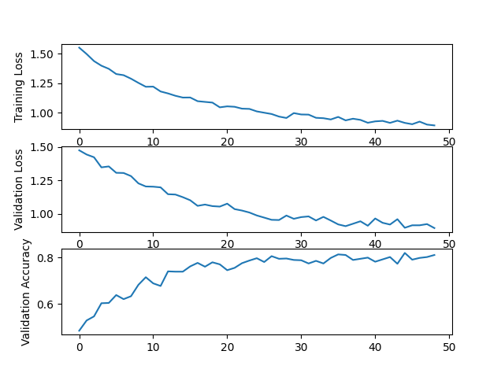

# Simple Neural Network

In this repository, a simple neural network is implemented using numpy. This library has been made to support a 3 layer
network structure

As such the library currently only support the following layers

1. BatchNorm
2. Fully Connected
3. ReLU
4. Sigmoid

## Sample implementation

The network shown above was trained and implemented. Based on the argmax layer at the end, it was assumed that this
layer was made for a binary classification task between two classes. As such the network was trained using a Binary
Cross Entropy loss function

Using simple linear regression for training, the following results were obtained.

## Weight Initialisation for Fully Connected Layer

Three forms of weight initialisation were developed:

1. Zero
2. Normal
3. He

### Zero Initialisation

This initialisation method is not to be used for an actual network. This was developed for future uses, such as in
implementing unit test code

### Normal Initialisation

A simple standard normal distribution is used to initialised the weights.

### He Initialisation

He initialisation was implemented as the preferred intialisation method for this network as ReLU activation was used in
the network. The benefits of He initialisation has been shown empirically and also shown theoretically

## Layer ABC

'public' fucntions

- forward
- backwards
- has_weights
- init_weights(init_method(enum?))

'protected' functions

- set_weights
- get_gradient

'private' variable

- weights

## FC layer : Layer ABC subclass

- FC(input_nodes, output_nodes)
- weights
- biases

# TODO

1. Implement batch support
1. Test batch norm
2. Implement backprop
3. create network class that has ordered list of layers. Iterate all forward and backwards for convenience
